# Hi there 👋

<a href="https://github.com/yousecjoe">
    
</a>

<h2>Cybersecurity</h2>

<a href="https://github.com/youngsecurity/pentest-agent-system">
    
</a>

<a href="https://github.com/redlinejoes/lions-mane-jellyfish">
    
</a>

<a href="https://github.com/redlinejoes/Cybersecurity-Vulnerability-Mindmap">
    
</a>

<a href="https://github.com/youngsecurity/wazuh">
    
</a>

<a href="https://github.com/redlinejoes/KaiMonkey">
    
</a>

<h2>DevSecOps Internal Developer Platforms</h2>

<a href="https://github.com/youngsecurity/DevSecOps">
  
</a>

<a href="https://github.com/youngsecurity/containment-field">
  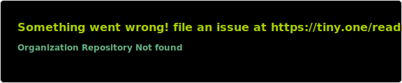
</a>

<a href="https://github.com/redlinejoes/underground-nexus">
    
</a>

<a href="https://github.com/youngsecurity/defense-unicorns-zarf">
    
</a>

<h2>AI & Bots</h2>

<a href="https://github.com/youngsecurity/ai-ollama">
    
</a>

<a href="https://github.com/youngsecurity/ai-ollama-webui">
    
</a>

<a href="https://github.com/youngsecurity/ai-privateztgpt">
    
</a>

<a href="https://github.com/youngsecurity/ai-open-interpreter">
    
</a>

<a href="https://github.com/youngsecurity/ai-discord-bot">
    
</a>

<a href="https://github.com/redlinejoes/cherry2k">
    
</a>

<h2>Game Streaming</h2>

<a href="https://github.com/youngsecurity/wolf">
    
</a>

<a href="https://github.com/redlinejoes/moonlight-qt">
    
</a>

<a href="https://github.com/redlinejoes/moonlight-ios">
    
</a>

<a href="https://github.com/redlinejoes/Easy-GPU-PV">
    
</a>

<h2>Containers</h2>

<a href="https://github.com/redlinejoes/docker-webtop">
    
</a>

<a href="https://github.com/youngsecurity/kasm-docker">
    
</a>

<a href="https://github.com/youngsecurity/kasm-workspaces-images">
    
</a>

<a href="https://github.com/redlinejoes/KasmVNC">
    
</a>

<h2>Stats & Metrics</h2>

<a href="https://github.com/redlinejoes/www">
    
</a>

<a href="https://github.com/yousecjoe/metrics">
    
</a>

<a href="https://github.com/yousecjoe/github-readme-stats">
    
</a>

<!-- markdownlint-configure-file {
  "MD033": {
    "allowed_elements": [
      "h1",
      "h2",
      "h3",
      "a",
      "br",
      "img",
      "span"
    ]
  }
} -->
